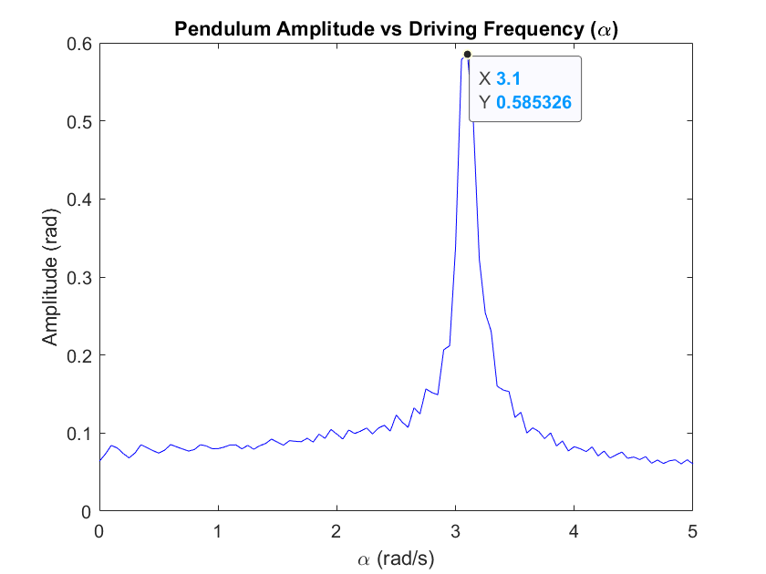

# Задача для семинара: Анализ маятника с демпфированием и внешним воздействием

## Формулировка задачи

Рассмотрим физический маятник, состоящий из жесткого стержня длиной $l$ и груза массой $m$ на его конце, на который действует ускорение свободного падения $g$. Маятник затухает из-за наличия силы трения, пропорциональной его угловой скорости, которую характеризует коэффициент затухания $b$. Кроме того, на маятник действует внешняя периодическая сила с синусоидальной формой $F \sin(\alpha t)$, где $F$ - амплитуда силы, а $\alpha$ - угловая частота внешней силы.

Уравнение движения маятника задается нелинейным дифференциальным уравнением второго порядка:

$$
\frac{d^2\theta}{dt^2} + \frac{b}{m} \frac{d\theta}{dt} + \frac{g}{l} \sin(\theta) = F \sin(\alpha t)
$$

где $\theta$ представляет собой угловое смещение от вертикали.

## Задачи

1. **Приведение к системе уравнений первого порядка:** Преобразуйте данное дифференциальное уравнение второго порядка в эквивалентную систему двух дифференциальных уравнений первого порядка (ОДУ). Введите соответствующие подстановочные переменные для представления углового смещения и угловой скорости.
2. **Определение параметров:** Определите все параметры, используемые в системе, включая физические константы, начальные условия и диапазон угловой частоты внешней силы $\alpha$.
3. **Численное решение:** Используя MATLAB, численно решите систему уравнений первого порядка для ряда значений $\alpha$, чтобы исследовать установившееся поведение маятника. Предположим, что маятник достигает установившегося состояния после достаточно длительного времени. Ваша симуляция должна охватывать диапазон значений $\alpha$ от 0 до 5 рад/с с интервалами в 0.05 рад/с.
4. **Графическое представление:** Постройте график амплитуды колебаний маятника в зависимости от частоты $\alpha$. Амплитуда должна быть определена из установившегося решения для углового смещения $\theta$ как, например, `max(abs(theta(floor(end/2):end, 1)))`. То есть, максимальное по модулю отклонение от нуля за последнюю половину значений.
5. **Анализ:** Проведите анализ полученного графика, обсудите физическую интерпретацию поведения маятника в ответ на изменение частоты привода $\alpha$. В частности, определите явления резонанса и объясните влияние демпфирования на амплитуду колебаний маятника.

## Параметры для использования

- Длина маятника $l$: 1 м
- Масса груза $m$: 1 кг
- Ускорение свободного падения $g$: 9.81 м/с²
- Коэффициент затухания $b$: 0.1 кг\*м²/с
- Амплитуда силы $F$: 0.2 Н
- Начальное угловое смещение $\theta_0$: $\pi/4$ рад
- Начальная угловая скорость $\omega_0$: 0 рад/с
- Время интегрирования: $t \in [0, 100]$ с

## Результаты к выполнению

- Скрипт MATLAB, который выполняет численное решение и генерирует требуемый график.
- Краткий отчет, включающий в себя полученную систему дифференциальных уравнений первого порядка, код MATLAB, сгенерированный график и ваш анализ поведения амплитуды маятника как функции от $\alpha$.

