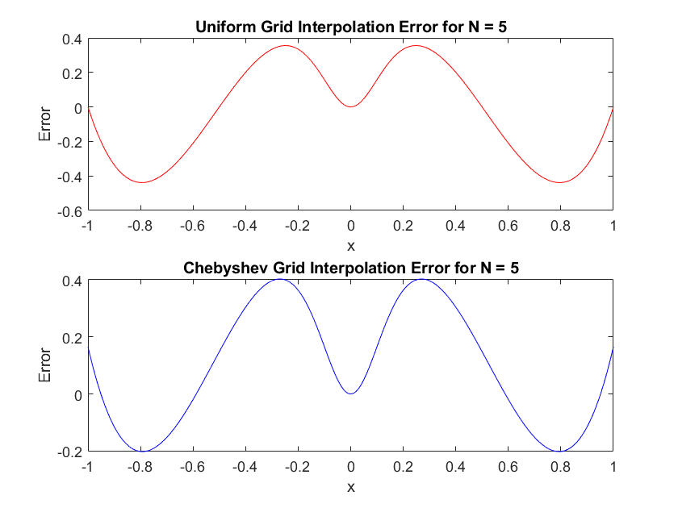
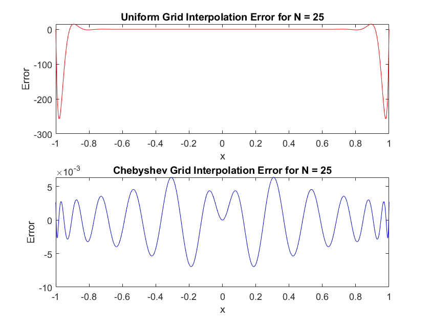

# Lagrange interpolation error

## 📚 Background

In the realm of numerical methods, polynomial interpolation stands as a crucial technique for approximating functions that are computationally taxing to evaluate directly. The classic method of Lagrange interpolation is frequently utilized due to its straightforward conceptual framework. However, it is important to acknowledge its limitations, such as the susceptibility to large errors—exemplified by Runge's phenomenon—when interpolating over equally spaced points. This phenomenon underscores the significance of prudent node selection to mitigate error amplification. With known functions, particularly those that are computationally intensive like Runge's function

$$f(x) = \frac{1}{1 + 25x^2},$$

it becomes vital to choose the right interpolation nodes to achieve an accurate approximation while minimizing computational overhead.

## 🎯 Objectives

1. **Understanding Interpolation Stability**: Investigate the stability of the Lagrange interpolation method and the influence of node selection on interpolation error.
2. **Practical MATLAB Application**: Apply MATLAB to interpolate a given function and analyze numerical results.
3. **Graphical Analysis**: Utilize MATLAB for graphing the interpolation error and the Lebesgue constant for both uniform and Chebyshev grids.
4. **Error Analysis Through True Function Comparison**: Compare the interpolation results against the true function values to assess accuracy and error behavior.

## 📝 Problem Statement

- **Step 1: Familiarize with Provided Function.** Review and understand the provided MATLAB function `LagrangeInterpolate.m`, which you will use for interpolation.
- **Step 2: Runge's Function Interpolation.** Use the given Runge's function `f = @(x) 1./(1 + 25*x.^2)` to generate true values for the interpolation points. This function will serve as the *"true"* function to compare against the interpolated values.
- **Step 3: Compute and Visualize Errors.** Compute the interpolation error for both uniform `x_uniform = linspace(a, b, N)` and Chebyshev grids `x_chebyshev = cos((2*k+1)*pi/(2*N))`, `k = 0:N-1`, by subtracting the true function values from the interpolated values at a fine grid of points `x_fine = linspace(a, b, 1000).'`.
- **Step 4: Graphical Visualization of Errors.** Plot the interpolation error against the fine grid points for different numbers of nodes `N = 5:10:45`. You should have two graphs for each `N`: one for uniform nodes and one for Chebyshev nodes.
- **Step 5: Analysis of the Lebesgue Constant.** Calculate the maximum interpolation error (Lebesgue constant, `max(abs(y_interp_grid - y_true))`) for each `N` and grid type, and plot these maxima as a function of `N`.
- **Step 6: Comparative Study and Conclusions.** Conclude your investigation by comparing the two sets of nodes. Discuss which node distribution—uniform or Chebyshev—yields a more stable approximation of the true function.

## 📊 Expected Outputs and Example Graphs

### Graphs for Interpolation Error

For each `N`, two plots showing the interpolation error should be generated. The x-axis will represent the range of interpolation points, and the y-axis will represent the error magnitude.





### Plot of Maximum Interpolation Error

A single plot comparing the maximum interpolation error as a function of `N` for both uniform and Chebyshev nodes. The x-axis will represent the number of nodes `N`, and the y-axis will represent the maximum error observed.


## LagrangeInterpolate.m

```matlab
function y = LagrangeInterpolate(x_val, y_val, x)
% Validate Inputs
if isempty(x_val) || isempty(y_val) || isempty(x)
    error('Input arrays x_val, y_val, and x must be non-empty.');
end
if ~isnumeric(x_val) || ~isnumeric(y_val) || ~isnumeric(x)
    error('All inputs must be numeric arrays.');
end
if length(x_val) ~= length(y_val)
    error('Arrays x_val and y_val must be of the same length.');
end
if length(unique(x_val)) < length(x_val)
    error('Elements in x_val must be unique.');
end

% Reshape inputs to column vectors
x_val = x_val(:).';
y_val = y_val(:).';
x = x(:);

% Lagrange Interpolation
n = length(x_val);
L = zeros(length(x), n);
for i = 1:n
    L(:, i) = prod((x - x_val(1:n ~= i)) ./ (x_val(i) - x_val(1:n ~= i)), 2);
end
y = L * y_val.';
end
```
