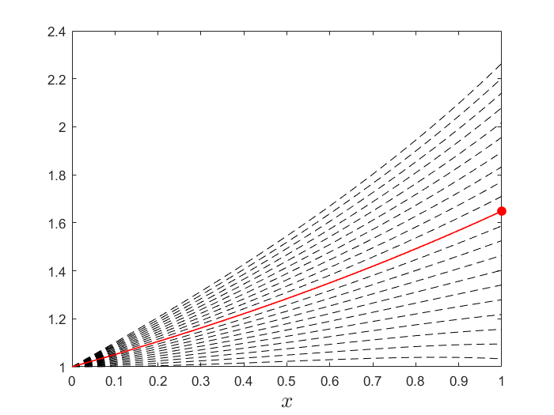
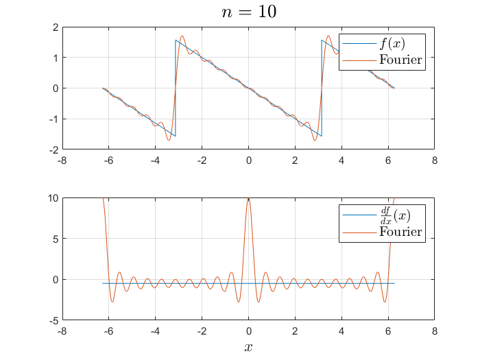
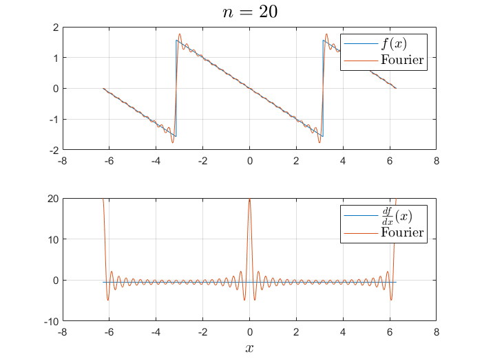
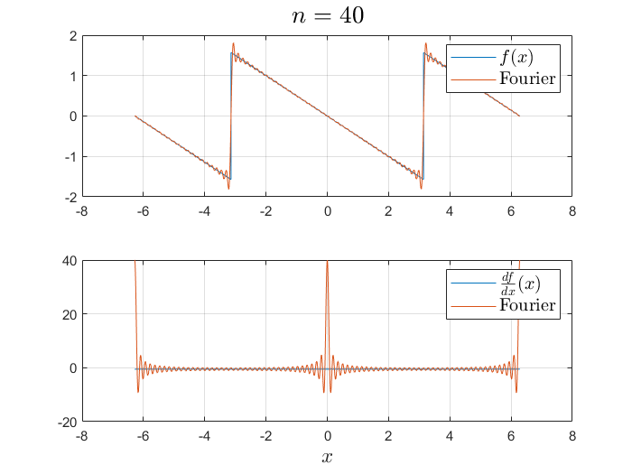

## Shooting Method

### Background

The **Shooting Method** is a numerical technique used to solve boundary value problems (BVPs) for ordinary differential equations (ODEs). It is particularly useful when you have conditions specified at two different points rather than initial conditions at a single point.

#### Why and When to Use the Shooting Method

- **Why**: Traditional methods for solving ODEs, like Euler's method or Runge-Kutta methods, are designed for initial value problems (IVPs), not BVPs.
- **When**: Use the shooting method when you need to solve a second-order ODE with boundary conditions at two different points.

### Practical Problem

#### Problem Statement

Given a second-order ODE:

$$r(x)\,y'' = g(x) - r'(x)\,y' - q(x)\,y$$

with boundary conditions $y(a) = \alpha$ and $y(b) = \beta$, we aim to find a solution $y(x)$ that satisfies these conditions.

#### Functions and Parameters

- Functions
  - $r(x) = -1$
  - $r'(x) = 0$
  - $q(x) = x^2 + 1$
  - $g(x) = e^{x/2}(x^2 + 0.75)$
- Boundary values
  - $\alpha = 1$
  - $\beta = e^{1/2}$

### Procedures

#### Step 1: Define the ODE

Convert the second-order ODE into a system of first-order ODEs.

```matlab
function dz = syst_fun(x, z, r, dr, q, g)
% Student Task: Fill in the function body
end
```

#### Step 2: Set Up Parameters

Define the boundary conditions and the range for the initial slope guesses.

```matlab
% Boundary values and range for initial slope
alpha = ...; % Student Task: Define alpha
beta = ...; % Student Task: Define beta
dy0 = linspace(0, 1, 21); % Range of initial guesses for derivative
```

#### Step 3: Implement the Shooting Method

Use a loop to iterate over the initial slope guesses and solve the ODE with each guess.

```matlab
% Shooting Method Loop
for k = 1:length(dy0)
    % Initial conditions for the current guess
    z0 = [alpha, dy0(k)]; % Initial conditions [y(a), y'(a)]
    
    % Student Task: Solve the ODE using ode45 and store the result in `Y`
    
    % Visualization (optional)
    % Student Task: Plot the solution and compare with the boundary condition at b
end
```

#### Step 4: Visualization and Selection

Create a plot to visualize the different solution paths.

#### Step 5: Evaluate and Select the Closest Path

Analyze the results to find the solution path that best matches the boundary conditions.

Check that the true solution for the provided parameters is

$$y(x) = e^{x/2}$$

### Visualisation



---

## Fourier Series Decomposition

Fourier approximation of the function $f(x) = -x/2$ applied periodically from $-\pi$ to $\pi$ can be represented as:

$$ f(x) = -\frac{x}{2} = \sum_{k=1}^\infty (-1)^k\,\frac{\sin(kx)}{k}$$

### Fourier Series of the Derivative

The derivative of $-\frac{x}{2}$ is a constant $-\frac{1}{2}$​. However, when decomposed into a Fourier series, the representation includes a delta function:

$$f'(x) = -\frac{1}{2} + \pi\,\delta(x - 2\pi m) = \sum_{k=1}^\infty \cos(kx)$$

where $m$ is an integer, and $\delta(x - 2\pi m)$ is the Dirac delta function.

### Exercise

#### Part 1: Visualizing the Function and its Fourier Series

Write MATLAB code to plot the function $-\frac{x}{2}$ and its Fourier series approximation for `n = [10, 20, 40]`.

```matlab
x = linspace(-2*pi+1e-6, 2*pi-1e-6, 50001);
f = -x/2;

% Plot for different values of n
for n = [10, 20, 40]
    f_series = 0;
    for k = 1:n
        f_series = ... ; % Fill the Fourier series of the function f
    end
    % Create a plot comparing f and f_series
end
```

#### Part 2: Visualizing the Derivative and its Fourier Series

Write MATLAB code to plot the constant function $-\frac{1}{2}$ and its Fourier series representation for `n = [10, 20, 40]`. Note: The delta function part will not be visualized in this exercise.

```matlab
f_prime = -1/2 * ones(size(x));

% Plot for different values of n
for n = [10, 20, 40]
    f_prime_ser = -1/2;
    for k = 1:n
        f_prime_ser = ... ; % Fill the Fourier serier of the function's f derivative. Disregard the delta function terms.
    end
    % Student Task: Create a plot comparing f_prime and f_prime_ser
end
```

### Fourier visualisations






