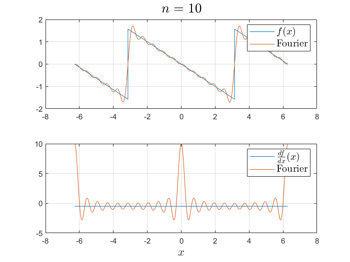

# Семинар 15 упражнения

## Метод стрельбы

### История

Метод **стрельбы** - это численная техника, используемая для решения краевых задач для обыкновенных дифференциальных уравнений (ОДУ). Он особенно полезен, когда условия заданы в двух разных точках, а не на начальные условия в одной точке.

#### Почему и когда следует использовать метод стрельбы

- **Почему**: Традиционные методы решения ОДУ, такие как метод Эйлера или метод Рунге-Кутты, предназначены для решения задач с начальными значениями, а не граничной задачи.
- **Когда**: Используйте метод стрельбы, когда вам нужно решить ОДУ второго порядка с граничными условиями в двух разных точках.

### Практическая проблема

#### Постановка задачи

Дана ОДУ второго порядка:

$$r(x) y'' = g(x) - r'(x) y' - q(x) y$$

с граничными условиями $y(a) = \alpha$ и $y(b) = \beta$, мы стремимся найти решение $y(x)$, удовлетворяющее этим условиям.

#### Функции и параметры

- Функции
  - $r(x) = -1$
  - $r'(x) = 0$
  - $q(x) = x^2 + 1$
  - $g(x) = e^{x/2}(x^2 + 0.75)$
- Граничные значения
  - $\alpha = 1$
  - $\beta = e^{1/2}$

### Процедуры

#### Шаг 1: Определите ODУ

Преобразуйте ОДУ второго порядка в систему ОДУ первого порядка.

```matlab
function dz = syst_fun(x, z, r, dr, q, g)
% Student Task: Fill in the function body
end
```

#### Шаг 2: Настройка параметров

Определите граничные условия и диапазон для начальных значений наклона.

```matlab
% Boundary values and range for initial slope
alpha = ...; % Student Task: Define alpha
beta = ...; % Student Task: Define beta
dy0 = linspace(0, 1, 21); % Range of initial guesses for derivative
```

#### Шаг 3: Реализация метода стрельбы

Используйте цикл для перебора начальных значений наклона и решения OДУ для каждого значения.

```matlab
% Shooting Method Loop
for k = 1:length(dy0)
    % Initial conditions for the current guess
    z0 = [alpha, dy0(k)]; % Initial conditions [y(a), y'(a)]
    
    % Student Task: Solve the ODE using ode45 and store the result in `Y`
    
    % Visualization (optional)
    % Student Task: Plot the solution and compare with the boundary condition at b
end
```

#### Шаг 4: Визуализация и выбор

Создайте график для визуализации различных путей решения.

#### Шаг 5: Оценка и выбор ближайшего пути

Проанализируйте результаты, чтобы найти решение, которое наилучшим образом соответствует граничным условиям.

Проверьте, что истинное решение для заданных параметров имеет вид

$$y(x) = e^{x/2}$$

### Визуализация


---

## Разложение в ряд Фурье

Фурье-аппроксимация функции $f(x) = -x/2$, применяемая периодически от $-\pi$ до $\pi$, может быть представлена в виде:

$$f(x) = -\frac{x}{2} = \sum_{k=1}^\infty (-1)^k \frac{\sin(kx)}{k}$$

### Ряд Фурье производной

Производная $-\frac{x}{2}$ является константой $-\frac{1}{2}$. Однако при разложении в ряд Фурье представление включает дельта-функцию:

$$f'(x) = -\frac{1}{2} + \pi \delta(x - 2\pi m) = \sum_{k=1}^\infty \cos(kx)$$

где $m$ - целое число, а $\delta(x - 2\pi m)$ - дельта-функция Дирака.

### Упражнение

#### Часть 1: Визуализация функции и ее ряда Фурье

Напишите код MATLAB для построения графика функции $-\frac{x}{2}$ и ее аппроксимации рядом Фурье для `n = [10, 20, 40]`.

```matlab
x = linspace(-2*pi+1e-6, 2*pi-1e-6, 50001);
f = -x/2;

% Plot for different values of n
for n = [10, 20, 40]
    f_series = 0;
    for k = 1:n
        f_series = ... ; % Fill the Fourier series of the function f
    end
    % Create a plot comparing f and f_series
end
```

#### Часть 2: Визуализация производной и ее ряда Фурье

Напишите код MATLAB для построения графика постоянной функции $-\frac{1}{2}$ и ее ряда Фурье для `n = [10, 20, 40]`. Примечание: В этом упражнении не будут визуализироваться дельта-функции.

```matlab
f_prime = -1/2 * ones(size(x));

% Plot for different values of n
for n = [10, 20, 40]
    f_prime_ser = -1/2;
    for k = 1:n
        f_prime_ser = ... ; % Fill the Fourier serier of the function's f derivative. Disregard the delta function terms.
    end
    % Student Task: Create a plot comparing f_prime and f_prime_ser
end
```

### Визуализация рядов Фурье




